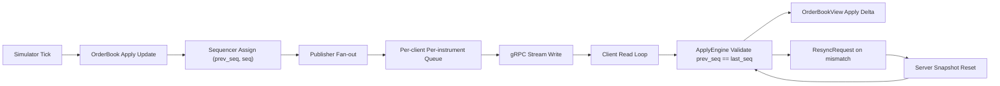

# Data Flow Diagram

```mermaid
flowchart LR
  A["Simulator Tick"] --> B["OrderBook Apply Update"]
  B --> C["Sequencer Assign (prev_seq, seq)"]
  C --> D["Publisher Fan-out"]
  D --> E["Per-client Per-instrument Queue"]
  E --> F["gRPC Stream Write"]
  F --> G["Client Read Loop"]
  G --> H["ApplyEngine Validate prev_seq == last_seq"]
  H --> I["OrderBookView Apply Delta"]
  H --> J["ResyncRequest on mismatch"]
  J --> K["Server Snapshot Reset"]
  K --> H
```
